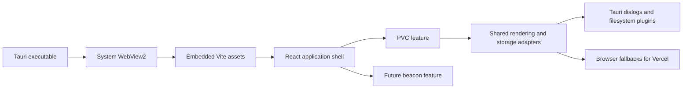

# ASC Track Designer Tauri + Vite Architecture Design

## Status and Decisions

- Status: ready for user review before implementation planning.
- Desktop stack: Tauri 2 + Vite + React 18 + TypeScript.
- Rendering: keep SVG for the first migration; 200 pieces do not justify Canvas/WebGL risk.
- Distribution: the Windows deliverable must be one portable `.exe`, not an installer that expands into an application directory.
- Native dependency: use the Windows system WebView2 runtime. Do not bundle a fixed WebView2 runtime because that would break the single-file requirement.
- Geometry: keep existing TypeScript formulas until profiling proves a Rust rewrite is useful.

## Goals

1. Remove the Electron Chromium bundle and embedded Next.js server so the editor opens in seconds instead of waiting on a local HTTP service.
2. Keep dragging, panning, zooming, selection, and editing smooth with approximately 200 PVC pieces.
3. Separate the application shell, PVC domain, rendering, storage, and future modes so PVC and beacon development can proceed independently.
4. Preserve existing PVC geometry, snapping, measurement, auto-fill, archives, project JSON, image export, and keyboard behavior.
5. Continue supporting a static web build for Vercel while the desktop build uses Tauri native dialogs and file access.

## Non-Goals

- No PVC formula retuning or visual redesign during the migration.
- No beacon editor implementation in this project phase; only establish its module boundary.
- No Canvas/WebGL renderer, Rust geometry rewrite, cloud storage, collaboration, or new project format.
- No automatic WebView2 bundling, updater, code signing, or installer workflow in the first Tauri release.

## Current Baseline

The packaged Electron application starts `.next/standalone/server.js`, searches for a free localhost port, waits up to 30 seconds for HTTP readiness, and then creates a Chromium window. This adds startup delay and duplicates browser/runtime memory. The current editor is also concentrated in `src/app/page.tsx`, so pointer movement can invalidate more React/SVG work than the changed piece requires.

Existing optimizations must survive the migration: frame-coalesced pointer updates, snap-target caching, debounced history persistence, and Canvas/Blob cleanup. Current measurements show roughly 367 MB desktop working set, while the JavaScript heap at 150 pieces is only about 12-16 MB. This indicates the desktop runtime and render update scope are higher priorities than moving geometry to Rust.

## Target Runtime Architecture



Production startup must create the Tauri window and load embedded Vite assets directly. It must not reserve a port, spawn Node.js, start an HTTP server, or poll for readiness. Development uses Vite's development server only.

The frontend remains a single-screen React application. A small mode shell selects a feature module without introducing a router. PVC remains the default implemented mode; the future beacon mode receives a separate feature boundary and cannot import PVC application state.

## Proposed Module Layout

```text
src/
  main.tsx
  app/
    App.tsx
    AppShell.tsx
    mode.ts
  features/
    pvc/
      domain/        # piece types, geometry, parser, statistics
      application/   # editor store, commands, project operations
      ui/            # designer, canvas, toolbar, minimap, piece views
    beacon/
      domain/        # created only when beacon implementation begins
      application/
      ui/
  shared/
    rendering/       # viewport and SVG coordinate helpers
    storage/         # legacy state, browser/Tauri file adapters
    ui/              # genuinely shared controls only
src-tauri/
  src/
    main.rs
    lib.rs
  capabilities/
  tauri.conf.json
```

Empty future-mode files or generic framework layers will not be added. Existing `track` modules move to `features/pvc/domain` only when their imports can be updated without changing formulas. UI components depend on application interfaces; domain code depends on neither React nor Tauri.

## State and Rendering Design

The PVC application layer will use a selector-based store with normalized data:

- `pieceIds: string[]` preserves draw order.
- `piecesById: Record<string, TrackPiece>` stores piece data.
- selection, viewport, tool mode, measurements, and project metadata are separate slices.
- each `TrackPieceView` subscribes only to its own piece and selected state.

Use Zustand as the small application store because selector subscriptions and immutable updates require less custom code than maintaining an event-emitter store. Domain functions remain plain TypeScript and receive explicit values; they do not read the store directly.

Pointer events follow this flow:

1. Pointer handlers record the latest screen/SVG position in transient refs.
2. At most one `requestAnimationFrame` callback applies movement per frame.
3. Dragging updates only affected piece records and the minimal overlay state.
4. Snapping candidates are computed from the cache already established at drag start.
5. Pointer release commits one undo command and persists the settled state.

The SVG `viewBox`, coordinate conversion, connection formulas, hit areas, and piece paths remain unchanged. Panning/zooming update a viewport group or viewBox once per frame. Static grid definitions and unchanged pieces must not be regenerated by pointer movement. React memoization and stable callbacks are used at component boundaries; no speculative spatial index is required for 200 pieces.

## Undo and Persistence

Runtime undo history becomes command-based and incremental. A command stores only affected piece IDs and their before/after values. A full drag creates one command at pointer release, not one entry per pointer event. New/delete/import operations may store a full replacement command because they are infrequent.

Compatibility is preserved as follows:

- Keep the existing keys: `piecesHistory`, `trackSizes`, `hiddenFixedSizes`, `trackArchives`, `currentTrackProject`, and `archive_*`.
- Keep persisted `piecesHistory` as the existing `TrackPiece[][]` snapshot format. On startup, adjacent snapshots are diffed once into runtime commands; when saving, runtime history is materialized back to compatible snapshots.
- Keep project/archive JSON field names and units unchanged.
- Add explicit schema guards that reject invalid imported data without replacing the current project.

Electron and Tauri use different browser storage origins, so key names alone cannot migrate installed user data. A bridge Electron release must export all known localStorage values to `%APPDATA%/asc-track-designer/migration-state-v1.json`. The Tauri build imports that envelope once, preserves the source file as a backup, and records a successful migration marker. Users who skip the bridge release can still import existing project JSON manually.

The single-file requirement applies to distribution. Normal runtime data in the Windows application-data directory is expected and matches current browser storage behavior.

## Native and Web Boundaries

Define narrow adapters rather than importing Tauri APIs throughout PVC code:

- `openProjectFile()` returns validated text or cancellation.
- `saveProjectFile(name, contents)` saves JSON.
- `saveExportedImage(name, blob)` saves PNG/JPEG output.
- `readLegacyState()` and `writeLegacyState()` preserve known local data.

The Tauri implementation uses official dialog/filesystem capabilities with least-required permissions. The Vercel implementation uses file inputs, object URLs, and browser downloads. Canceling a dialog is a normal result. Read, parse, or write failures produce a visible message and leave the current editor state unchanged.

## Single-File Windows EXE

The release artifact is the raw optimized Tauri executable, renamed with the product version, for example `ASC.3.0.0.exe`. Vite assets, icons, and application metadata must be compiled or embedded into that executable. The release must contain no Node.js runtime, `.next` directory, sidecar process, frontend asset folder, or sibling DLL controlled by this project.

WebView2 is treated as a Windows system component, not a packaged application file. Before creating the webview, the Rust entry point checks for a usable runtime. If it is missing, a native Windows dialog explains the requirement and provides the official installation path; the application must not hang on a blank window. A fixed WebView2 runtime is explicitly prohibited because it requires additional files and substantially increases size.

The release gate must test the copied EXE from an otherwise empty folder on supported Windows 10 and Windows 11 machines with WebView2 installed. The test also verifies that starting and using the editor does not create required files beside the EXE. Generated settings in AppData and user-selected exports are allowed.

## Phased Migration and Rollback

1. **Baseline and characterization:** record startup, memory, package size, and 200-piece interaction traces; capture representative JSON/archive fixtures and PVC manual checks. Rollback point: current `v2.0.2`.
2. **Electron migration bridge:** add only the versioned local-state backup and verify that existing projects, archives, sizes, theme, and history are represented. Release or run this bridge before switching the active desktop shell.
3. **Vite web shell:** run the existing React editor through Vite with behavior unchanged. Keep Next/Electron available. Verify static Vercel output and all PVC fixtures.
4. **Feature boundaries:** move pure domain and UI responsibilities in small commits. Geometry file moves are mechanical; each move requires lint, build, and PVC regression checks.
5. **Tauri shell in parallel:** add `src-tauri`, load the Vite output, import the bridge envelope, and implement native adapters. Do not remove Electron until Tauri passes startup, file, export, and storage tests.
6. **Render/store optimization:** normalize piece state, add per-piece subscriptions, and move undo to commands while preserving the legacy persisted format. Compare traces after each optimization.
7. **Portable packaging:** produce and validate the one-file EXE, WebView2 preflight, version metadata, icon, and clean-folder launch.
8. **Retire old stack:** remove Next, Electron, standalone-server preparation, and unused package scripts only after every acceptance gate passes. A tagged Electron release remains the rollback artifact.

Each phase is a separate commit. A failed gate is fixed or reverted within that phase; later phases do not compensate for an unresolved regression.

## Performance Acceptance Criteria

Measurements use the same user machine, release builds, the same saved 200-piece project, and at least three runs. Record median and worst result.

- Warm start to interactive editor: at most 2 seconds.
- Cold start to interactive editor: at most 4 seconds, reported separately from first-download antivirus scanning.
- No localhost server startup or 30-second readiness path in production.
- During a 10-second 200-piece drag and zoom trace: p95 frame time at most 20 ms and no application task longer than 100 ms caused by editor updates.
- Pointer-to-piece movement should remain within one rendered frame during continuous drag.
- Idle working set after 30 seconds: target at most 180 MB; loaded 200-piece project: target at most 220 MB.
- Portable EXE: target at most 30 MB, with actual Electron `v2.0.2` size recorded for comparison.
- Image export may temporarily allocate a large canvas, but memory must return after export and repeated exports must not grow retained memory.

If an absolute target is missed, the migration is not silently accepted. The trace and bottleneck must be documented, then the target or implementation is changed with user approval.

## PVC Regression Matrix

The following must behave identically before removing Electron/Next:

- Add all straight and curved piece variants with unchanged dimensions and default placement.
- Drag one piece, snap both endpoint types, disconnect, reconnect, and rotate with `Tab`.
- Box-select from different window aspect ratios; multi-select, drag, rotate, and delete.
- Pan, wheel zoom, reset/center view, minimap navigation, and resize the window.
- Measure two points and clear measurement.
- Auto-fill between eligible endpoints and compare generated length, angle, and placement.
- Undo/redo across add, drag, rotate, delete, import, and multi-piece operations.
- New project, current-project recovery, named archives, archive deletion, and fixed-size visibility settings.
- Export JSON in the old format and re-import files produced by `v2.0.2`.
- Export PNG/JPEG at existing resolution and verify Blob/Canvas cleanup.
- Verify `Delete`, `Tab`, `Ctrl+S`, `Ctrl+O`, `Ctrl+E`, theme persistence, and all toolbar actions.
- Verify the Vercel build performs core drawing operations without Tauri APIs.

## Testing Strategy

Before structural moves, add characterization tests for pure geometry, parser, statistics, coordinate conversion, snapping, and auto-fill using values captured from the current build. Add storage fixture tests for every legacy key and project/archive JSON. Store representative 1-piece, connected multi-piece, and 200-piece fixtures in the repository.

Use component/integration tests for store commands, selection, and undo. Use browser automation against the Vite build for pointer workflows and export triggers. Use a Tauri smoke checklist for launch, native dialogs, persistence, migration, and clean-folder execution because browser tests cannot validate the desktop shell.

Required checks at each relevant phase are TypeScript type checking, linting, unit/integration tests, Vite production build, and the smallest affected manual PVC workflow. The final phase additionally requires release EXE construction and Windows launch testing.

## Error Handling and Recovery

- Migration writes are atomic: write a temporary envelope, validate it, then replace the destination.
- Failed legacy import retains both the current Tauri state and source backup and reports which section failed.
- Corrupt project/archive data is never applied partially.
- File dialog cancellation makes no state change.
- A failed image export releases allocated Canvas, Blob, and object URL resources.
- Fatal startup errors use a native dialog and exit; they must not leave an invisible background process.

## Approval Boundary

Implementation begins only after this specification is reviewed and approved. The next artifact will be a commit-by-commit implementation plan with exact verification commands and rollback gates. No production runtime files are changed as part of this design document.
